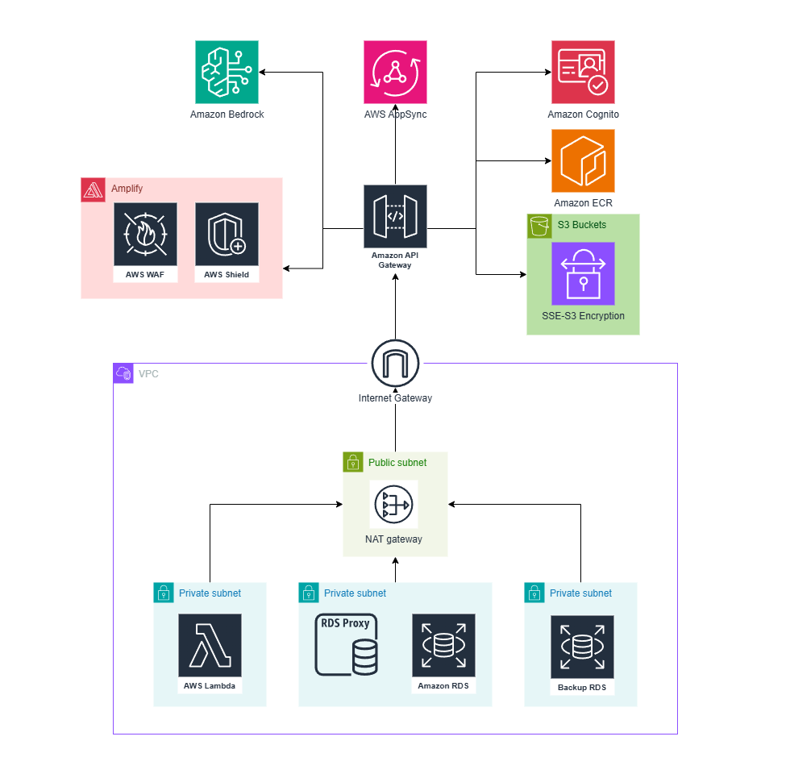
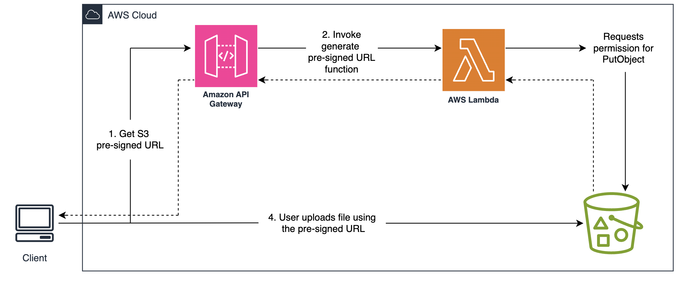
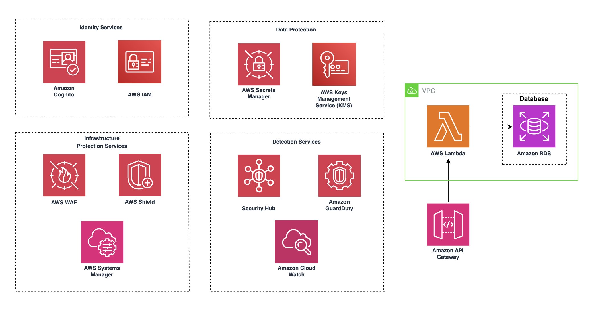

# Security Documentation & Network Architecture

## Shared Responsibility Model


### Customer Responsibilities (Security in the Cloud):

- Data Protection
- Identity & Access Management
- Application Security
- Network Security Configuration:

[Learn more](https://aws.amazon.com/compliance/shared-responsibility-model/)

This document outlines the existing network and security configurations implemented for this project. Additionally, it provides recommendations and guidance on leveraging AWS services and features to enhance security, monitor application performance, and maintain compliance

## 1. Network Architecture



### 1.1 VPC & Subnets

VPC Configuration:

- Leveraged existing VPC in AWS Account since organizational policies prevent new VPC creation
- CIDR Range is inherited from existing VPC configuration

#### Subnet Configuration:

| Subnet Type | AZ            | Key Services                  |
| ----------- | ------------- | ----------------------------- |
| Private     | ca-central-1a | Lambda                        |
| Private     | ca-central-1b | RDS Proxy, Amazon RDS         |
| Public      | ca-central-1  | NAT Gateway, Internet Gateway |

#### Services Deployment:

#### Private Subnets:

- **AWS Lambda:**

  - Runtime environment for application logic
  - No public IP addresses
  - Outbound internet via NAT Gateway

- **Amazon RDS (PostgreSQL):**

  - Accessed exclusively via RDS Proxy
  - No direct public access
  - Encrypted connections via SSL/TLS

  Since VPC Endpoints are not used, Lambda accesses S3, ECR, and other AWS services over the public internet through the NAT Gateway.

#### Public Subnets:

- **NAT Gateway:** [Learn more](https://docs.aws.amazon.com/vpc/latest/userguide/vpc-nat-gateway.html)

  - Required for private subnet services to fetch external packages/updates
  - Egress-only internet access for Lambda
  - Cost-optimized single AZ deployment

- **Internet Gateway:** [Learn more](https://docs.aws.amazon.com/vpc/latest/userguide/VPC_Internet_Gateway.html)
  - Enables public access to API Gateway

#### Services outside of VPC:

- **S3 Buckets:** [Learn more](https://aws.amazon.com/pm/serv-s3/?gclid=CjwKCAiAlPu9BhAjEiwA5NDSA1VjMbPPYbzEKHPHFwna4OblKvQe5sm9sigb9iHW69Zc_pxuRifGzxoCUiEQAvD_BwE&trk=936e5692-d2c9-4e52-a837-088366a7ac3f&sc_channel=ps&ef_id=CjwKCAiAlPu9BhAjEiwA5NDSA1VjMbPPYbzEKHPHFwna4OblKvQe5sm9sigb9iHW69Zc_pxuRifGzxoCUiEQAvD_BwE:G:s&s_kwcid=AL!4422!3!536324434071!e!!g!!s3!11346198420!112250793838)

  - Accessed via NAT Gateway through Lambda functions
  - No internet routing through NAT Gateway

  #### How objects in S3 are accessed:

  

  The above diagram illustrates the use of S3 pre-signed URLs in our architecture. The process works as follows:

  1. Client Request: The client first requests a pre-signed URL by making an API call to the Amazon API Gateway

  2. Pre-Signed URL Generation: The API Gateway invokes an AWS Lambda function, which is responsible for generating the pre-signed URL. The Lambda function checks for the appropriate permissions (PutObject action) for the requested S3 bucket

  3. Permission Validation: If permissions are validated, the Lambda function returns the generated pre-signed URL to the client

  4. File Upload: The client uses this pre-signed URL to upload files directly to S3, bypassing the need for the server to handle large file uploads. This approach ensures:

     - Secure, time-limited access to the S3 bucket without exposing long-term credentials

     - Offloading file transfer workload from backend servers, reducing latency and cost

  Learn More:

  - [Sharing objects with presigned URLs](https://docs.aws.amazon.com/AmazonS3/latest/userguide/ShareObjectPreSignedURL.html)

  - [Download and upload objects with presigned URLs](https://docs.aws.amazon.com/AmazonS3/latest/userguide/using-presigned-url.html)

  Additional security measures:

  - All data is encrypted at rest using SSE-S3 (AES-256)
  - Public access is blocked for all S3 buckets
  - SSL connections are enforced for secure data transfer

- **Amazon API Gateway:**

  - Deployed in AWS public cloud space
  - Protected by regional security controls
  - Custom Lambda Authorizers validate user permissions before accessing endpoints for 3 different roles
  - Uses Cognito User Pools for authentication and role-based access control
  - IAM policies restrict API Gateway access based on user roles

- **Amazon Bedrock:**

  - Requires explicit model access requests for utilization
  - API interactions secured using IAM roles and encrypted connections

- **Amazon EventBridge + API Gateway WebSocket:**

  - EventBridge is used as the notification event bus for backend event routing
  - Event producers are limited to trusted Lambda functions with scoped `events:PutEvents` permissions
  - Notification delivery to connected clients is handled through API Gateway WebSocket with scoped `execute-api:ManageConnections` access

- **Amazon Cognito:**

  - Provides authentication and authorization for Lambda access
  - Role-based access control via IAM roles and policies
  - Triggers (Pre-Sign-Up, Post-Confirmation) manage user provisioning.
  - Secures API and WebSocket access through JWT validation and Lambda authorizers
  - Authorization is database-driven

- **Amazon ECR:**
  - Lambda functions utilize Docker images stored in Amazon ECR
  - Images are securely pulled over the internet via the NAT Gateway

## 1.2 Security Configuration



This diagram illustrates how our architecture handles key security aspects by leveraging AWS services tailored for each security domain. Identity Services, including AWS IAM and Amazon Cognito, ensure secure authentication and access control. Data Protection is enforced through AWS Secrets Manager and AWS KMS for secure storage and encryption. Infrastructure Protection relies on AWS WAF, AWS Shield, and AWS Systems Manager to safeguard against threats. Detection Services such as Security Hub, Amazon GuardDuty, and Amazon CloudWatch provide continuous monitoring and threat detection

## 2. Security Controls

### 2.1 Network Security

**Security Groups:**

| Name         | Rules                              |
| ------------ | ---------------------------------- |
| Lambda-SG    | Allow outbound: 5432 (RDS Proxy)   |
| RDS-Proxy-SG | Allow inbound: 5432 from Lambda-SG |
| Default-SG   | Block all inbound, allow outbound  |

**NACLs:**

- Default NACLs in use
- No custom rules - inherits Control Tower baseline:
  - Inbound: ALLOW ALL
  - Outbound: ALLOW ALL

### 2.2 Event-Driven Notification Security

**Purpose:** Secure real-time notifications using least-privilege IAM and controlled event routing

- A dedicated EventBridge bus is used for notification events
- Producer Lambdas publish events only with scoped `events:PutEvents` permission to the notification bus
- EventBridge rules filter allowed sources and detail types before invoking the notification service
- The notification service Lambda is granted only required permissions:
  - DynamoDB (`PutItem`, `Query`, `UpdateItem`, `DeleteItem`) on notification and connection tables
  - API Gateway WebSocket `execute-api:ManageConnections` on `POST @connections/*`
- Notification service supports:
  - EventBridge invocation for event-driven delivery
  - REST API invocation for notification read/update operations, with authenticated user context validation

## 3. Data Store Security

### 3.1 Encryption

**Purpose:** Ensure all stored data is encrypted at rest to meet compliance and security standards

### 3.2 Access Controls

#### RDS Proxy:

- IAM authentication required
- Connection pooling limits credential exposure
- Audit logs enabled via CloudWatch

## 4. Secrets & Parameters

### 4.1 Credential Management

**Purpose:** Securely manage sensitive credentials such as RDS passwords

#### AWS Secrets Manager:

- Creates a new secret named DBSecret for RDS credentials
- Enhances security by regularly updating credentials without manual intervention

## 5. Security Services

### 5.1 AWS WAF & Shield

**WAF Rules Applied:** [Learn more](https://docs.aws.amazon.com/AmazonCloudFront/latest/DeveloperGuide/distribution-web-awswaf.html)

Two separate WAF Web ACLs protect the application:

**CloudFront WAF** (scoped to Amplify frontend distribution, deployed in us-east-1):
- AWSManagedRulesCommonRuleSet (covers SQLi, XSS, and other common web exploits)
- Rate limiting: 1 000 requests per 5 minutes per IP

**Regional API Gateway WAF** (scoped to REST API stage):
- AWSManagedRulesCommonRuleSet (OWASP Top 10 protection)
- IP-based rate limiting: 2 000 requests per 5 minutes per IP
- Per-user rate limiting: 200 requests per 5 minutes per authenticated user (keyed on MD5 hash of Authorization header)

**Shield Standard:** [Learn more](https://docs.aws.amazon.com/waf/latest/developerguide/ddos-overview.html)

- Enabled on CloudFront/Amplify distribution (protects API Gateway as well via passthrough)
- CloudWatch alarms for DDoS detection

### 5.2 Security Hub

**Purpose:** Enable continuous security monitoring and automate compliance checks [Learn more](https://docs.aws.amazon.com/securityhub/latest/userguide/what-is-securityhub.html)

#### Account-level monitoring recommendations:

- Enable Security Hub in the AWS Management Console for the target region (e.g., ca-central-1)
- Integrate Security Hub with AWS services (e.g., GuardDuty) for comprehensive security analysis
- Use Security Hub Insights to identify and prioritize security issues across AWS accounts

#### How to Use:

- Navigate to Security Hub in the AWS console
- Review findings generated from AWS best practices and integrated security services
- Apply security standards like AWS Foundational Security Best Practices
- Use custom insights and filters (e.g., resources.tags.Project = "LAIGO", depending on the name your instance is deployed under) to focus on relevant resources
- Remediate issues based on the severity and compliance requirements

## 6. RDS Security

### 6.1 RDS Encryption

**Purpose:** Secure RDS data at rest using AWS KMS encryption and prevent accidental deletion

- Enabled storage encryption for storageEncrypted is set to true
- Referenced an existing KMS key using kms.Key.fromKeyArn() for encryption
- deletionProtection is set to true to prevent unintended RDS deletions.

### 6.2 RDS Security Groups

**Purpose:** Control database access by allowing PostgreSQL traffic (5432) only from trusted CIDRs

CDK Implementation:

```typescript
vpcStack.privateSubnetsCidrStrings.forEach((cidr) => {
  dbSecurityGroup.addIngressRule(
    ec2.Peer.ipv4(cidr),
    ec2.Port.tcp(5432),
    `Allow PostgreSQL traffic from ${cidr}`
  );
});
```

### 6.3 RDS Proxy

**Purpose:** Purpose: Enhance RDS access performance, security, and scalability by utilizing Amazon RDS Proxy

- IAM Authentication: RDS Proxy requires IAM authentication for secure access
- Connection Pooling: Efficiently manages and reuses database connections, reducing the load on RDS
- TLS Enforcement: Secure connections with optional TLS enforcement for data-in-transit encryption
- Role Management: IAM roles grant rds-db:connect permissions to trusted Lambda functions
- Fault Tolerance: Proxies automatically handle database failovers, improving application availability
- Security Groups: Configured to allow only trusted Lambda functions and services within private subnets to connect

## 7. S3 Security

### Bucket Security Configurations

**Purpose:** Ensure data confidentiality by encrypting S3 objects and blocking public access [Learn more](https://aws.amazon.com/s3/security/)

- Enabled S3-managed encryption (S3_MANAGED) for data at rest
- Blocked all public access with blockPublicAccess: s3.BlockPublicAccess.BLOCK_ALL
- Enforced SSL connections for secure data transfer by setting enforceSSL: true

CDK Implementation:

```typescript
blockPublicAccess: s3.BlockPublicAccess.BLOCK_ALL,
enforceSSL: true, // Enforce secure data transfer
encryption: s3.BucketEncryption.S3_MANAGED,
```

## 8. Security Group Configurations

**Purpose:** Secure network access between AWS components, ensuring least-privilege access

### 8.1 Key Security Group Controls in CDK:

| **Component**               | **CDK Location**  | **Key Security Control**                                                                                                 | **Purpose**                                                   |
| --------------------------- | ----------------- | ------------------------------------------------------------------------------------------------------------------------ | ------------------------------------------------------------- |
| **RDS**                     | `DatabaseStack`   | PostgreSQL (5432) only from private/VPC CIDRs                                                                            | Restricts DB access to internal networks                      |
| **Lambda**                  | `ApiGatewayStack` | IAM policies for Secrets and ENI management access                                                                       | Limits Lambda access to necessary resources                   |
| **Lambda Authorizers**      | `ApiGatewayStack` | VPC-deployed with DB access; dedicated IAM roles with Secrets Manager read (IDP + DB credentials)                        | Enables database-backed identity resolution and role validation |
| **EventBridge + WebSocket** | `ApiGatewayStack` | Scoped `events:PutEvents` (publish), EventBridge rule filtering, and scoped `execute-api:ManageConnections` for delivery | Ensures secure, authenticated real-time notification delivery |
| **RDS Proxy**               | `DatabaseStack`   | IAM-based `rds-db:connect` permissions                                                                                   | Adds an extra layer of security between Lambda and RDS        |

### 8.2 Examples from CDK infrastructure where these security measures are implemented:

#### Lambda Access to Secrets Manager:

```javascript
lambdaRole.addToPolicy(
  new iam.PolicyStatement({
    actions: ["secretsmanager:GetSecretValue"],
    resources: [
      `arn:aws:secretsmanager:${this.region}:${this.account}:secret:*`,
    ],
  })
);
```

#### Private Subnet Access: Allows PostgreSQL traffic (port 5432) only from private subnet CIDRs:

```typescript
vpcStack.privateSubnetsCidrStrings.forEach((cidr) => {
  dbSecurityGroup.addIngressRule(
    ec2.Peer.ipv4(cidr),
    ec2.Port.tcp(5432),
    `Allow PostgreSQL traffic from private subnet CIDR range ${cidr}`
  );
});
```

#### Lambda Network Access: Enables Lambda to create network interfaces (ENIs) for VPC access

```typescript
this.dbInstance.connections.securityGroups.forEach((securityGroup) => {
  securityGroup.addIngressRule(
    ec2.Peer.ipv4(vpcStack.vpcCidrString),
    ec2.Port.tcp(5432),
    "Allow PostgreSQL traffic from public subnets"
  );
});
```

#### Lambda Access to Secrets Manager:

```typescript
lambdaRole.addToPolicy(
  new iam.PolicyStatement({
    effect: iam.Effect.ALLOW,
    actions: ["secretsmanager:GetSecretValue"],
    resources: [
      `arn:aws:secretsmanager:${this.region}:${this.account}:secret:*`,
    ],
  })
);
```

### 8.3 Lambda Function Access & Invocation

#### **Summary of Lambda Function Access** [Learn more](https://docs.aws.amazon.com/cognito/latest/developerguide/cognito-user-pools-working-with-lambda-triggers.html#:~:text=Except%20for%20Custom%20sender%20Lambda,attempts%2C%20the%20function%20times%20out.):

| **Lambda Function**                 | **Access Level** | **Trigger/Invocation**                     | **Who Can Access?**                         |
| ----------------------------------- | ---------------- | ------------------------------------------ | ------------------------------------------- |
| `studentFunction`                   | Private          | student                                    | Authenticated users in **student** group    |
| `instructorFunction`                | Private          | instructor                                 | Authenticated users in **instructor** group |
| `adminFunction`                     | Private          | admin                                      | Authenticated users in **admin** group      |
| `preSignupLambda`                   | Private          | Cognito **Pre-Sign-Up** trigger            | **Cognito internal trigger** only           |
| `addStudentOnSignUp`                | Private          | Cognito **Post-Confirmation** trigger      | **Cognito internal trigger** only           |
| `TextGenLambdaDockerFunc`           | Private          | student/instructor                         | **student or instructor** group users       |
| `GeneratePreSignedURLFunc`          | Private          | student/instructor                         | **student or instructor** group users       |
| `CaseGenLambdaDockerFunc`           | Private          | student                                    | **student** group users                     |
| `SummaryLambdaDockerFunction`       | Private          | student/instructor                         | **student or instructor** group users       |
| `audioToTextFunc`                   | Private          | student                                    | **student** group users                     |
| `PlaygroundTextGenLambdaDockerFunc` | Private          | student/instructor                         | **student or instructor** group users       |
| `assessProgressFunction`            | Private          | student                                    | **student** group users                     |
| `notificationServiceFunction`       | Private          | EventBridge / API Gateway                  | Internal event‑driven notification service  |
| `adminLambdaAuthorizer`             | Private (VPC)    | API Gateway Lambda Authorizer (admin)      | Internal to **API Gateway**; validates JWT + DB role lookup |
| `studentLambdaAuthorizer`           | Private (VPC)    | API Gateway Lambda Authorizer (student)    | Internal to **API Gateway**; validates JWT + DB role lookup |
| `instructorLambdaAuthorizer`        | Private (VPC)    | API Gateway Lambda Authorizer (instructor) | Internal to **API Gateway**; validates JWT + DB role lookup |
| `wsAuthorizer`                      | Private (VPC)    | API Gateway WebSocket Authorizer ($connect)| Internal to **API Gateway**; validates JWT + DB user lookup |

## 9. Cognito User Authentication

### 9.1 Purpose

AWS Cognito provides user authentication and authorization, enabling **secure access** to Lambda functions based on user roles. By integrating Cognito with Lambda, we ensure that **only authenticated users** with the **appropriate permissions** can invoke Lambda functions, maintaining the **principle of least privilege**

[Learn more](https://docs.aws.amazon.com/cognito/latest/developerguide/authentication.html)

---

### 9.2 How Cognito Secures Lambda Invocations

- **User Pool Creation:**
  Cognito **User Pools** manage user registration and sign-in

  - Supports multi-role user groups (e.g., student, instructor, admin)
  - Automatic verification of user credentials

- **User Provisioning Bootstrapping:**
  Cognito Lambda triggers handle user account setup:

  - **Pre-Sign-Up** trigger: Validates email domains before user registration (only allows emails from authorized domains)
  - **Post-Confirmation** trigger: Creates user record in database immediately after email verification
  - Authorization logic is handled by Lambda authorizers (not via Cognito triggers), ensuring real-time role/permission checks via database queries

- **Lambda Authorization (Database-Backed):**
  Each Lambda authorizer follows an IDP-agnostic, database-backed pattern:

  1. JWT token is verified for signature and expiration using IDP configuration stored in Secrets Manager
  2. The `sub` claim is extracted as `idpId` (IDP-agnostic identifier)
  3. The authorizer queries the PostgreSQL database to resolve `idpId` to an internal `userId` and retrieve user metadata (email, name, roles)
  4. Role membership is enforced against the database `roles` array, not Cognito group claims
  5. On success, the authorizer returns an IAM Allow policy with `userId` (database UUID) as `principalId` and user metadata in the authorization context
  6. Downstream Lambda handlers receive the database `userId` directly, decoupled from the IDP

  Key security properties:
  - Roles are validated against the database as the source of truth, not JWT claims
  - A stale-cache re-fetch mechanism queries the database a second time before denying access, preventing false rejections after recent role changes
  - User metadata is cached within a single Lambda execution context for performance
  - JWKS (JSON Web Key Set) is cached across warm invocations to avoid repeated fetches
  - Access is logged and monitored via **CloudWatch** using AWS Lambda Powertools structured logging
  - IDP credentials are retrieved from Secrets Manager, allowing IDP migration without code changes

---

### 9.3 Cognito Integration in CDK (ApiGatewayStack)

#### **User Pool & App Client Configuration:**

```typescript
this.userPool = new cognito.UserPool(this, `${id}-pool`, {
  userPoolName: userPoolName,
  signInAliases: {
    email: true,
  },
  selfSignUpEnabled: true,
  autoVerify: {
    email: true,
  },
  passwordPolicy: {
    minLength: 12,
    requireLowercase: true,
    requireUppercase: true,
    requireDigits: true,
    requireSymbols: true,
  },
  accountRecovery: cognito.AccountRecovery.EMAIL_ONLY,
});

this.appClient = this.userPool.addClient(`${id}-pool`, {
  userPoolClientName: userPoolName,
  authFlows: {
    userPassword: true,
    custom: true,
    userSrp: true,
  },
});
```

#### **Authorizer Lambda Configuration (Database-Backed):**

All REST and WebSocket authorizers are deployed in the VPC with database connectivity and dedicated least-privilege IAM roles:

```typescript
// Each authorizer gets a dedicated IAM role with:
// - Secrets Manager read access (IDP credentials + DB credentials)
// - VPC networking (ENI management)
// - CloudWatch Logs
const adminAuthorizerRole = new iam.Role(this, `${id}-adminAuthorizerRole`, {
  assumedBy: new iam.ServicePrincipal("lambda.amazonaws.com"),
  managedPolicies: [
    iam.ManagedPolicy.fromAwsManagedPolicyName("service-role/AWSLambdaVPCAccessExecutionRole"),
  ],
});
this.secret.grantRead(adminAuthorizerRole);       // IDP config (JWT issuer/client)
db.secretPathUser.grantRead(adminAuthorizerRole);  // DB credentials for user lookup

// Authorizer Lambda with VPC access and PostgreSQL + JWT layers
const adminAuthorizerFunction = new lambda.Function(this, `${id}-AdminAuthorizerFunction`, {
  runtime: lambda.Runtime.NODEJS_22_X,
  code: lambda.Code.fromAsset("lambda/authorization"),
  handler: "adminAuthorizerFunction.handler",
  timeout: Duration.seconds(10),
  vpc: vpcStack.vpc,
  vpcSubnets: { subnetType: ec2.SubnetType.PRIVATE_WITH_EGRESS },
  layers: [jwt, postgres, javascriptPowertoolsLayer],
  role: adminAuthorizerRole,
  environment: {
    SM_IDP_CREDENTIALS: this.secret.secretName,
    SM_DB_CREDENTIALS: db.secretPathUser.secretName,
    RDS_PROXY_ENDPOINT: db.rdsProxyEndpoint,
  },
});
```

### 9.4 Cognito Email Delivery Security (SES + DKIM)

When `DomainName` is provided to CDK deployment, Cognito email delivery is configured to use Amazon SES with a domain identity.

- CDK creates an SES `EmailIdentity` using the Route 53 hosted zone for the domain.
- DKIM and MAIL FROM DNS records are managed automatically in Route 53.
- Verification emails are sent from `noreply@<DomainName>` using the verified domain identity.
- If `DomainName` is omitted, Cognito falls back to its built-in sender (`no-reply@verificationemail.com`).

Security and operational notes:

- DKIM helps recipient mail servers validate that email content was authorized by the sender domain.
- Route 53 hosted zone must exist as a public hosted zone in the same AWS account for fully automated verification.
- In SES sandbox mode, sending is restricted to verified recipients/identities; production workloads require an SES production access request.

## 10 API Gateway Security

### 10.1 Purpose

AWS API Gateway acts as the entry point for clients, enabling secure, scalable, and managed API interactions. It integrates with AWS IAM, Cognito, and Lambda Authorizers to enforce authentication and authorization.

### 10.2 Security Measures Applied:

- Cognito User Pools for authentication
- IAM Policies to enforce least-privilege access
- Lambda Authorizers for custom permission validation
- AWS WAF to mitigate DDoS attacks and malicious traffic

[Learn more](https://docs.aws.amazon.com/apigateway/latest/developerguide/security.html)

### 10.3 Custom Lambda Authorizers for API Gateway

Three role-specific Lambda authorizers protect the REST API. Each authorizer validates JWT tokens, resolves the IDP identity to a database user, and enforces role membership before granting access.

#### Authorizer Architecture

All three REST authorizers (admin, instructor, student) share the same core pattern:

1. Extract JWT from the `Authorization` header
2. Verify token signature and expiration using IDP configuration from Secrets Manager
3. Extract `sub` claim as `idpId`
4. Query the PostgreSQL database (via RDS Proxy) to resolve `idpId` → `userId` and retrieve roles
5. Enforce role membership against the database `roles` array
6. Return a scoped IAM Allow policy with `userId` as `principalId` and user metadata in context

Each authorizer runs in the VPC with access to the database and uses dedicated least-privilege IAM roles.

#### Role-Specific Behavior

| Authorizer | Endpoints | Required Database Role | Scoped Policy Resource |
| --- | --- | --- | --- |
| Admin | `/admin/*` | `admin` | `*/admin/*` |
| Instructor | `/instructor/*` | `instructor` | `*/instructor/*` |
| Student | `/student/*` | `student` (with exceptions) | `*/student/*` |

The student authorizer includes additional route-level logic:
- **Shared routes** (e.g., `GET /student/profile`, `GET /student/get_disclaimer`) are accessible to any authenticated user regardless of role
- **Instructor case routes** (e.g., `GET /student/case_page`, `GET /student/get_messages`) are accessible to users with the `instructor` role, enabling case detail views for supervisors
- All other `/student/*` endpoints require the `student` role

#### Stale-Cache Protection

All authorizers implement a re-fetch mechanism: if the cached user metadata does not include the required role, the authorizer queries the database a second time with `forceRefresh` before denying access. This prevents false rejections when roles are updated by an admin while the authorizer Lambda is warm.

#### Context Passed to Downstream Handlers

```json
{
  "userId": "database-uuid",
  "email": "user@example.com",
  "firstName": "John",
  "lastName": "Doe",
  "roles": "[\"student\"]"
}
```

Downstream Lambda handlers use `userId` (database UUID) from the authorizer context, fully decoupled from the IDP identity.

**Key Features**:

- Database-backed authorization: Roles are validated against PostgreSQL, not JWT claims
- IDP-agnostic: IDP configuration is stored in Secrets Manager, enabling provider migration without code changes
- Scoped IAM policies: Each authorizer returns policies scoped to its role's endpoint prefix, preventing cross-role access leakage
- VPC-deployed: Authorizers run in private subnets with direct database connectivity via RDS Proxy
- Structured logging: AWS Lambda Powertools provides consistent, searchable CloudWatch logs

## 11. WebSocket API Security

### 11.1 Purpose

API Gateway WebSocket API enables real-time, bidirectional communication for features like live chat and notifications. Security controls ensure that only authenticated users can establish connections, control message routing, and prevent abuse through connection limits and rate limiting.

[Learn more](https://docs.aws.amazon.com/apigateway/latest/developerguide/apigateway-websocket-api.html)

---

### 11.2 WebSocket Security Controls

**Authorization (Database-Backed):**

- All WebSocket connections are gated by a dedicated Lambda authorizer (`wsAuthorizer.js`)
- The authorizer follows the same IDP-agnostic, database-backed pattern as the REST authorizers:
  1. Extracts JWT token from `Sec-WebSocket-Protocol` header, `Authorization` header, or `?token=` query parameter
  2. Verifies token signature and expiration using IDP configuration (Cognito User Pool ID and Client ID from environment variables)
  3. Extracts `sub` claim as `idpId` and queries the PostgreSQL database to resolve it to a `userId`
  4. Returns an IAM Allow policy with `userId` (database UUID) as `principalId` and user metadata (email, name, roles) in context
  5. On failure, returns an explicit Deny policy
- The authorizer runs in the VPC with database connectivity via RDS Proxy
- Downstream WebSocket handlers (`$connect`, `$default`) receive the database `userId` from the authorizer context, decoupled from the IDP
- Role-based access checks for privileged actions (e.g., playground features) are performed by the `$default` handler using the `roles` context field

**Connection Management:**

- Per-user connection limit is enforced (maximum 5 concurrent connections) to reduce connection-flood abuse
- Downstream Lambda invocations are restricted by scoped `lambda:InvokeFunction` permissions (no wildcard invoke access)

**Real-Time Message Delivery:**

- `execute-api:ManageConnections` is granted only to approved real-time Lambda functions
- Delivery permissions are resource-scoped to the WebSocket `@connections` management endpoint

### 11.3 WebSocket Security Controls

| **Control**                   | **Mechanism**                                                                  | **Purpose**                                                              |
| ----------------------------- | ------------------------------------------------------------------------------ | ------------------------------------------------------------------------ |
| **Authentication**            | JWT validation + database user lookup in WebSocket Lambda authorizer            | Only authenticated, database-registered users can connect                |
| **Authorization**             | Database role checks in `$default` handler using authorizer context             | Restricts privileged actions (playground) to admin/instructor roles       |
| **Identity Resolution**       | `idpId` → `userId` database lookup in authorizer                               | Decouples WebSocket identity from IDP, uses database UUID                |
| **Connection Limits**         | Per-user max 5 concurrent connections                                          | Prevents connection exhaustion abuse                                     |
| **Invocation Scoping**        | Scoped `lambda:InvokeFunction` permissions                                     | Prevents unauthorized backend function invocation                        |
| **Secure WebSocket Delivery** | Scoped `execute-api:ManageConnections` permissions                             | Only approved services can send messages to active WebSocket connections |

### 11.4 Attack Surface Mitigation

- **DDoS / Connection Flood**: Rate limiting via Regional API Gateway WAF (2 000 requests/5 min per IP, 200/5 min per user) and CloudFront WAF (1 000 requests/5 min per IP)
- **Unauthorized Message Injection**: Authenticated-channel enforcement and authorizer checks reduce unauthorized message submission
- **Stale Connection Cleanup**: DynamoDB TTL automatically removes connection records older than configured retention
- **Auditability**: Connection and invocation activity is logged in CloudWatch for investigation and incident response

---

## 12 AWS Systems Manager Security

### 12.1 Purpose

AWS Systems Manager (SSM) provides centralized management, automation, and security enforcement for AWS resources, helping secure access to infrastructure and maintain compliance through patching, logging, and configuration management

Amazon CloudWatch is used to monitor AWS resources, applications, and security logs. It plays a crucial role in performance monitoring [Learn more](https://aws.amazon.com/systems-manager/)

### 12.2 Security Measures:

- Parameter Store Access Logs: Monitors access to sensitive configuration data, including secrets and API keys
- Anomalous Parameter Store Access: Triggers alarms when unauthorized services or users attempt to retrieve sensitive parameters

## 13 AWS Key Management Service (KMS)

### 13.1 Purpose

AWS KMS (Key Management Service) provides centralized encryption key management, helping to keep sensitive data encrypted both at rest and in transit. It integrates with multiple AWS services to offer scalable and automated encryption security [Learn more](https://aws.amazon.com/kms/)

### 13.2 Security Measures:

- KMS Key Access Logs: Records every use of an encryption key to help detect unauthorized decryption attempts
- Excessive Key Usage: Triggers alerts if a specific key is accessed more than usual, potentially indicating a compromise

## 14. Amazon ECR

**Purpose:**
Amazon Elastic Container Registry (ECR) provides a secure, scalable private container registry. It integrates with AWS Identity and Access Management (IAM) and other AWS security services to protect container images

[Learn more](https://docs.aws.amazon.com/AmazonECR/latest/userguide/infrastructure-security.html)

---

**Key Security Measures:**

1. **Private Repositories**

   - Images are stored privately; access is controlled by IAM and resource-based policies.
   - [Learn more](https://docs.aws.amazon.com/AmazonECR/latest/userguide/repository-policies.html)

2. **TLS Enforcement**

   - All ECR API calls must use TLS 1.2 or higher, ensuring data in transit is secure.

3. **IAM Roles & Policies**

   - There are permissions (e.g., `ecr:GetAuthorizationToken`, `ecr:BatchGetImage`) that control who can push/pull images.

4. **Lifecycle Policies**

   - Automatically remove outdated images to minimize storage costs and reduce the attack surface.

5. **Image Scanning**
   - All ECR repos have image scanning enabled to detect vulnerabilites and remediate issues.

---

**Recommendation:**

- Regularly review ECR logs in **AWS CloudTrail** to identify suspicious or unauthorized access attempts
- Implement **lifecycle policies** to retain only the most recent, patched images for better security and cost efficiency
