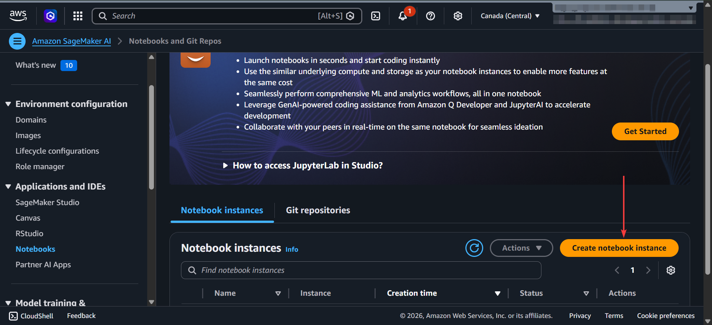
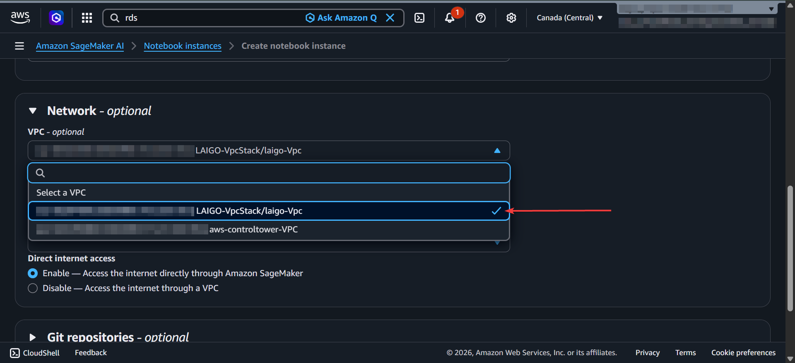
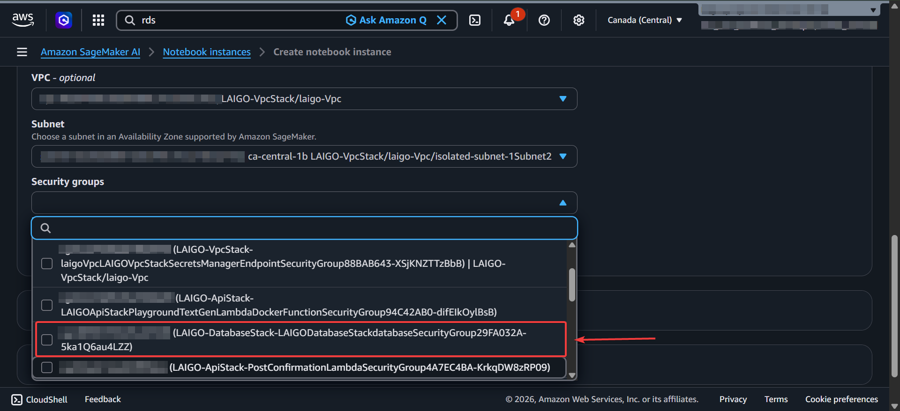

# User Disable / Removal Guide

This guide documents how to disable or completely remove a user from the LAIGO platform. Because there is no built-in admin UI for user disable/deletion, the process requires manual SQL execution against the database and/or a Cognito console action.

- Option 1: Disable the user (preferred for temporary account suspension or when records must be retained).
- Option 2: Full deletion (permanent, irreversible removal of user data and Cognito identity).

## Prerequisites

- AWS Console access with permissions to:
  - Amazon SageMaker AI (to create a notebook instance in the VPC)
  - Amazon Cognito (to delete the user from the User Pool)
  - AWS Secrets Manager (to retrieve database credentials from the console)
- The user's email address or `cognito_id` (UUID)

## Overview

User data lives in two places:

1. **PostgreSQL (RDS)** — the `users` table and all related records across multiple tables
2. **AWS Cognito** — the user's authentication identity and group membership

Both the database and Cognito must be cleaned for a full removal.

---

## Step 1: Connect to the Database via SageMaker AI

The RDS instance runs inside an isolated VPC with no public access. Use a SageMaker AI notebook instance to connect.

### 1a. Create a Notebook Instance

- Open the **AWS Console** and navigate to **Amazon SageMaker AI** > **Notebooks** > **Notebook instances**
- Click **Create notebook instance**
- Give it a name (e.g., `laigo-db-admin`)



### 1b. Select the VPC

- Under **Network**, select the LAIGO VPC (the one created by the `VpcStack`)



### 1c. Select the Subnet

- Choose one of the **private subnets** (labeled `private-subnet-1` in the VPC). Do not use the isolated subnets — the notebook needs internet access to install Python packages via pip.


### 1d. Select the Security Group

- For the security group, select the **RDS database's security group** (not the default VPC security group). You can find it in the AWS Console under **RDS** > **Databases** > select your instance > **Connectivity & security** > **VPC security groups**. It will be named something like `DatabaseStack-database-SecurityGroup-XXXX`. Using this same security group ensures the notebook can reach the RDS Proxy without any additional rules.



### 1e. Connect to the Database

- Once the notebook instance is running, click **Open Jupyter** and create a new **Python 3** notebook (New > conda_python3).

Each code block below is a separate notebook cell. Copy and paste them in order.

**Cell 1 — Install psycopg2:**

```python
!pip install psycopg2-binary
```

**Cell 2 — Import libraries:**

```python
import psycopg2
```

**Cell 3 — Enter database credentials:**

Retrieve the credentials from the AWS Console:
1. **RDS Proxy endpoint**: Navigate to **RDS** > **Proxies** > select your proxy > copy the **Proxy endpoint** (looks like `xxxxx-proxy.proxy-xxxxx.region.rds.amazonaws.com`)
2. **Username and password**: Navigate to **Secrets Manager** > search for `{StackPrefix}-LAIGO/credentials/rdsDbCredential` > click **Retrieve secret value** > copy the `username` and `password`

```python
DB_HOST = ""      # <-- Paste the RDS Proxy endpoint from RDS Proxies
DB_PORT = ""      # <-- Paste the port from Secrets Manager
DB_NAME = ""      # <-- Paste the dbname from Secrets Manager
DB_USER = ""      # <-- Paste the username from Secrets Manager
DB_PASS = ""      # <-- Paste the password from Secrets Manager
```

**Cell 4 — Connect to the database:**

> The RDS Proxy requires TLS, so `sslmode='require'` is mandatory.

```python
conn = psycopg2.connect(
    host=DB_HOST,
    port=DB_PORT,
    dbname=DB_NAME,
    user=DB_USER,
    password=DB_PASS,
    sslmode="require",
)
conn.autocommit = False
cur = conn.cursor()
print("Connected successfully")
```

---

## Step 2: Identify the User

**Cell 5 — Look up the user by email:**

> Replace `user@example.com` with the actual email address.

```python
USER_EMAIL = "user@example.com"  # <-- CHANGE THIS

cur.execute("""
    SELECT user_id, idp_id, user_email, first_name, last_name, roles
    FROM users
    WHERE user_email = %s;
""", (USER_EMAIL,))

user = cur.fetchone()
if user:
    USER_ID = str(user[0])
    print(f"Found user: {user[2]} ({user[3]} {user[4]})")
    print(f"user_id: {USER_ID}")
    print(f"idp_id (cognito): {user[1]}")
    print(f"roles: {user[5]}")
else:
    print("User not found. Check the email address.")
    USER_ID = None
```

---

## Step 3: Delete User Data from PostgreSQL

The tables must be cleaned in the correct order to respect foreign key constraints. Some tables use `ON DELETE CASCADE` from the `cases` table, but the user's direct references need explicit deletion.

**Cell 6 — Delete all user data (run as a transaction):**

> This uses the `USER_ID` variable from Cell 5. Make sure it printed a valid user before running this.

```python
assert USER_ID is not None, "No user found — go back to Cell 5"

try:
    # 1. Delete annotations authored by this user
    cur.execute('DELETE FROM annotations WHERE author_id = %s;', (USER_ID,))

    # 2. Delete case feedback authored by this user
    cur.execute('DELETE FROM case_feedback WHERE author_id = %s;', (USER_ID,))

    # 3. Delete messages sent by this user (as instructor)
    cur.execute('DELETE FROM messages WHERE instructor_id = %s;', (USER_ID,))

    # 4. Delete case reviewer assignments
    cur.execute('DELETE FROM case_reviewers WHERE reviewer_id = %s;', (USER_ID,))

    # 5. Delete instructor-student relationships
    cur.execute('DELETE FROM instructor_students WHERE instructor_id = %s OR student_id = %s;', (USER_ID, USER_ID))

    # 6. Delete cases owned by this user
    #    (cascades to: case_feedback, summaries, annotations, audio_files, messages linked by case_id)
    cur.execute('DELETE FROM cases WHERE student_id = %s;', (USER_ID,))

    # 7. Remove authorship from prompt versions (keeps the prompts, nullifies author)
    cur.execute('UPDATE prompt_versions SET author_id = NULL WHERE author_id = %s;', (USER_ID,))

    # 8. Remove authorship from disclaimers
    cur.execute('UPDATE disclaimers SET author_id = NULL WHERE author_id = %s;', (USER_ID,))

    # 9. Remove updated_by from role_labels
    cur.execute('UPDATE role_labels SET updated_by = NULL WHERE updated_by = %s;', (USER_ID,))

    # 10. Delete the user record
    cur.execute('DELETE FROM users WHERE user_id = %s;', (USER_ID,))

    conn.commit()
    print(f"Successfully deleted all data for user {USER_ID}")

except Exception as e:
    conn.rollback()
    print(f"Error — transaction rolled back: {e}")
```

> Steps 7-9 nullify the `author_id`/`updated_by` rather than deleting the records, since prompts and disclaimers are shared system resources. If you want to delete them entirely, replace the `UPDATE` lines with `DELETE FROM` statements.

**Cell 7 — Verify deletion:**

```python
cur.execute('SELECT count(*) FROM users WHERE user_id = %s;', (USER_ID,))
print(f"Users remaining: {cur.fetchone()[0]}")  # Should be 0

cur.execute('SELECT count(*) FROM cases WHERE student_id = %s;', (USER_ID,))
print(f"Cases remaining: {cur.fetchone()[0]}")  # Should be 0
```

**Cell 8 — Close the connection:**

```python
cur.close()
conn.close()
print("Connection closed")
```

---

## Step 4: Disable the User in Cognito (recommended for access blocking)

If you want to prevent the user from logging into the app while keeping their data intact, disable them in Cognito instead of deleting them.

1. Open the **AWS Console** and navigate to **Amazon Cognito**
2. Select the LAIGO User Pool (named `{StackPrefix}-ApiStack-pool` or similar)
3. Go to **Users** and search for the user by email
4. Select the user and click **Disable user**

Alternatively, use the AWS CLI:

```bash
aws cognito-idp admin-disable-user \
  --user-pool-id [user_pool_id] \
  --username [cognito_username]
```

> The `cognito_username` is typically the user's email address. The `user_pool_id` can be found in the Cognito console or in the CDK outputs.


---

## Step 5: Remove the User from Cognito

1. Open the **AWS Console** and navigate to **Amazon Cognito**
2. Select the LAIGO User Pool (named `{StackPrefix}-ApiStack-pool` or similar)
3. Go to **Users** and search for the user by email
4. Select the user and click **Delete user**

Alternatively, use the AWS CLI:

```bash
aws cognito-idp admin-delete-user \
  --user-pool-id [user_pool_id] \
  --username [cognito_username]
```

> The `cognito_username` is typically the user's email address. The `user_pool_id` can be found in the Cognito console or in the CDK outputs.


